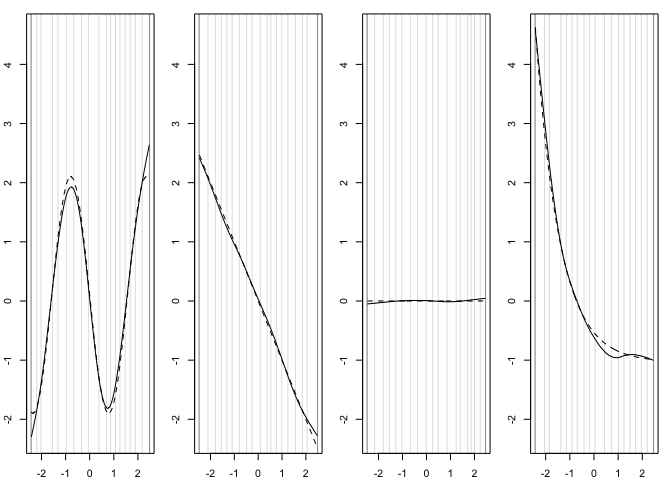
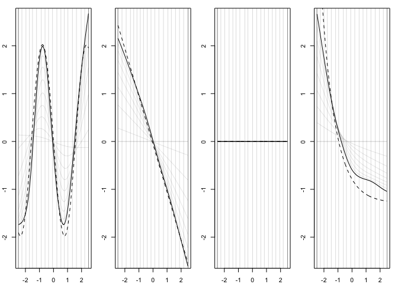
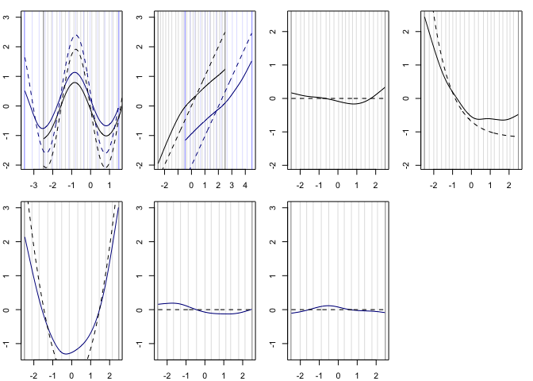
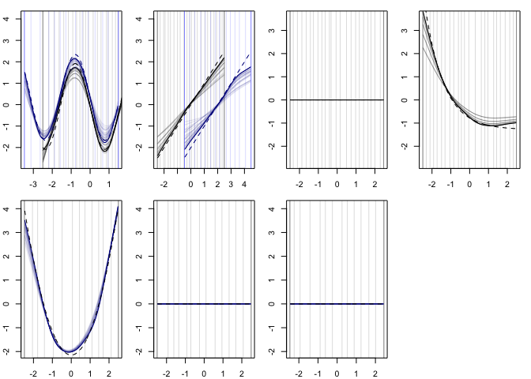

Using the semipadd2pop package
------------------------------

See the package documentation for details. Install with the R commands:

`install.packages("devtools")`

`devtools::install_github("gregorkb/aenetgt")`

Fitting a sparse nonparametric model to a single data set
---------------------------------------------------------

The `semipadd` function fits a sparse semiparametric regression model to
a single data set using user-specified tuning parameter values.

The following code generates a synthetic data set with continuous
responses using the `get_semipadd_data` function and uses the `semipadd`
function to fit a sparse semiparametric regression model. The
`plot_semipadd` function plots the fitted nonparametric effects. The
true effects are plotted with dashed lines.

    data <- get_semipadd_data(n = 200, response = "continuous")

    semipadd.out <- semipadd(Y = data$Y,
                             X = data$X,
                             nonparm = data$nonparm,
                             response = "continuous",
                             w = 1,
                             d = 20,
                             xi = 1,
                             lambda.beta = 1,
                             lambda.f = 1,
                             tol = 1e-3,
                             max.iter = 500)

    plot_semipadd(semipadd.out, 
                  true.functions = list( f = data$f,
                                         X = data$X))

The `semipadd_cv_adapt` function fits a sparse semiparametric regression
model to a single data set with the tuning parameter governing sparsity
chosen via crossvalidation.

The following code generates a synthetic data set with binary responses
using the `get_semipadd_data` function and uses the `semipadd_cv_adapt`
function to fit a sparse semiparametric regression model. The tuning
parameter governing sparsity is chosen via crossvalidation. The
`plot_semipadd_cv_adapt` function plots the fitted nonparametric
effects, showing with transparent curves the fitted effects under
candidate tuning parameter values which were not chosen by
crossvalidation. The true effects are plotted with dashed lines.

    data <- get_semipadd_data(n = 1000, response = "binary")

    semipadd_cv_adapt.out <- semipadd_cv_adapt(Y = data$Y,
                                               X = data$X,
                                               nonparm = data$nonparm,
                                               response = "binary",
                                               w = 1,
                                               d = 20,
                                               xi = 1,
                                               n.lambda = 10,
                                               lambda.min.ratio = .01,
                                               lambda.max.ratio = 1,
                                               lambda.beta = 1,
                                               lambda.f = 1,
                                               tol = 1e-3,
                                               maxiter = 1000,
                                               report.prog = FALSE)

    plot_semipadd_cv_adapt(semipadd_cv_adapt.out, 
                           true.functions  = list( f = data$f,
                                                   X = data$X))

Combining data sets to fit two sparse semiparametric additive models
--------------------------------------------------------------------

The `semipadd2pop` function fits sparse semiparametric regression models
to two data sets which have some covariates in common. The function
requires the user to choose values of the parameters governing the
sparsity of the fitted models and the penalization towards similar fits
of common covariate effects.

The following code generates two synthetic data sets with group testing
responses using the `get_semipadd2pop_data` function and uses the
`semipadd2pop` function to fit sparse semiparametric regression models.
The `plot_semipadd2pop` function plots the fitted nonparametric effects
in both data sets. The true effects are plotted with dashed lines.

    data <- get_semipadd2pop_data(n1 = 1000, n2 = 800, response = "gt")

    semipadd2pop.out <- semipadd2pop(Y1 = data$Y1,
                                     X1 = data$X1,
                                     nonparm1 = data$nonparm1,
                                     Y2 = data$Y2,
                                     X2 = data$X2,
                                     nonparm2 = data$nonparm2,
                                     response = "gt",
                                     rho1 = 1,
                                     rho2 = 1,
                                     nCom = data$nCom,
                                     d1 = 25,
                                     d2 = 15,
                                     xi = .5,
                                     w1 = 1,
                                     w2 = 1,
                                     w = 1,
                                     lambda.beta = .01,
                                     lambda.f = .01,
                                     eta.beta = .1,
                                     eta.f = .1,
                                     tol = 1e-3,
                                     maxiter = 500)
                                 
    plot_semipadd2pop(semipadd2pop.out,
                      true.functions = list(f1 = data$f1,
                                            f2 = data$f2,
                                            X1 = data$X1,
                                            X2 = data$X2))

The `semipadd2pop_cv_adapt` function fits sparse semiparametric
regression models to two data sets with some common covariates. It
choosing values of the tuning parameters governing sparsity and
penalization towards similar fitting of common effects via
crossvalidation.

The following code generates two synthetic data sets with continuous
responses using the `get_semipadd2pop_data` function and uses the
`semipadd2pop_cv_adapt` function to fit a sparse semiparametric
regression models for the two data sets. The tuning parameters governing
sparsity and penalization towards similarity in the fitted effects of
common covariates are chosen via crossvalidation. The
`plot_semipadd2pop_cv_adapt` function plots the fitted nonparametric
effects in each data set, showing with transparent curves the fitted
effects under candidate tuning parameter values which were not chosen by
crossvalidation. The true effects are plotted with dashed lines.

    data <- get_semipadd2pop_data(n1 = 300, n2 = 200, response = "continuous")

    semipadd2pop_cv_adapt.out <- semipadd2pop_cv_adapt(Y1 = data$Y1,
                                                       X1 = data$X1,
                                                       nonparm1 = data$nonparm1,
                                                       Y2 = data$Y2,
                                                       X2 = data$X2,
                                                       nonparm2 = data$nonparm2,
                                                       response = "continuous",
                                                       rho1 = 2,
                                                       rho2 = 1,
                                                       w1 = 1,
                                                       w2 = 1,
                                                       w = 1,
                                                       nCom = data$nCom,
                                                       d1 = 25,
                                                       d2 = 15,
                                                       xi = .5,
                                                       n.lambda = 5,
                                                       n.eta = 5,
                                                       lambda.min.ratio = 0.01,
                                                       lambda.max.ratio = 0.10,
                                                       n.folds = 5,
                                                       lambda.beta = 1,
                                                       lambda.f = 1,
                                                       eta.beta = 1,
                                                       eta.f = 1,
                                                       tol = 1e-3,
                                                       maxiter = 1000,
                                                       report.prog = FALSE)

    plot_semipadd2pop_cv_adapt(semipadd2pop_cv_adapt.out,
                               true.functions = list(f1 = data$f1,
                                                     f2 = data$f2,
                                                     X1 = data$X1,
                                                     X2 = data$X2))

